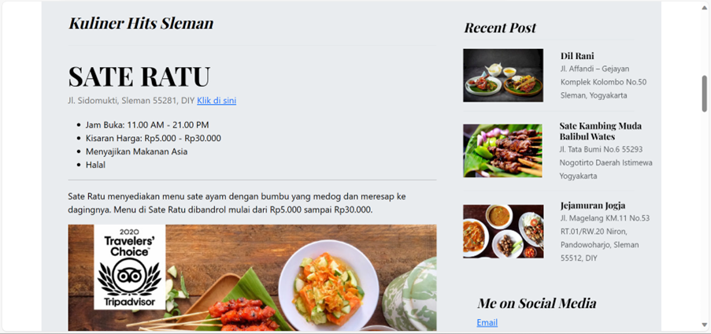
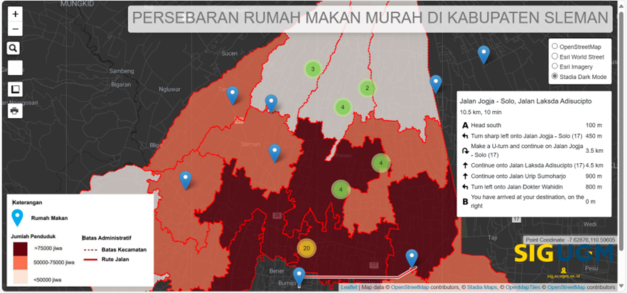
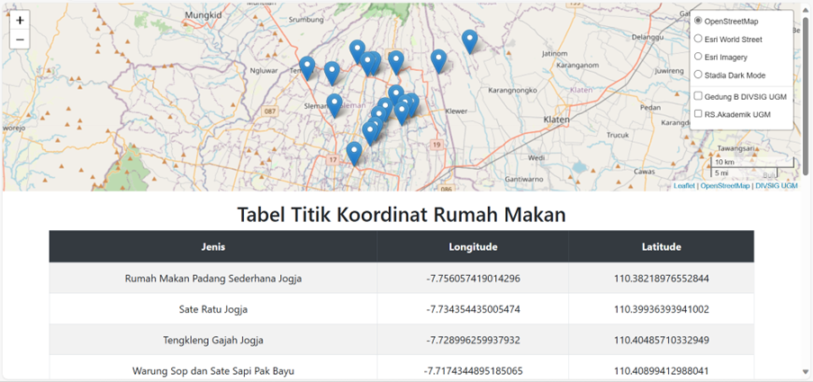
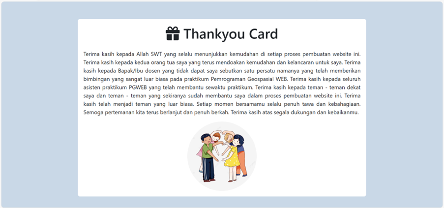

# rensponsi_sayy

Nama Produk : Makan Lur Makan

Latar Belakang : Kabupaten Sleman merupakan lokasi dari beberapa univertas ternama di Indonesia, seperti UGM, UNY, UPNVY, dsb sehingga banyak pelajar dari luar Provinsi DIY yang menempuh pendidikan di Provinsi DIY terutama di Kabupaten Sleman. Selain itu, Kabupaten Sleman terdapat berbagai macam rumah makan yang menyajikan berbagai jenis olahan yang dapat menjadi alternatif untuk memenuhi kebutuhan primer mahasiswa/i dan menjadi sarana healing dari hectic-nya perkuliahan.

Deskripsi Produk : WebGIS Makan Lur Makan menyajikan informasi mengenai rekomendasi berbagai rumah makan di Kabupaten Sleman yang dapat mempermudah mahasiswa/i rantau untuk memenuhi kebutuhan primer(pangan).

Komponen Pembangunan Produk : Penyusunan webGIS Makan Lur Makan mengintegrasikan beberapa komponen, seperti BootStrap untuk penyusunan GUI web menggunakan BootStrap berupa Blog, Leaflet JS untuk menampilkan peta yang memuat titik koordinat lokasi dari rumah makan di Sleman, dan Database yang disusun dengan PHPMyAdmin yang bertujuan untuk menampilkan titik koordinat lokasi beserta tabel dari titik koordinat lokasi tersebut. Selain itu, pembuatan webGIS Makan Lur Makan juga diintegrasikan dengan Google Maps API yang bertujuan untuk menampilkan lokasi langsung pada Google Maps.

Sumber Data : Google Maps, Data SHP Kabupaten Sleman

Website :

https://sites.google.com/view/ramintenkaliurang/

https://gudegyudjum.com/

https://www.detik.com/jogja/kuliner/d-6840072/sate-ratu-kuliner-terkenal-di-jogja-harga-lokasi-dan-jam-buka

https://www.tripadvisor.co.id/Restaurant_Review-g2304080-d7060197-Reviews-Rosella_Kitchen_by_Richie-Sleman_Sleman_District_Yogyakarta_Region_Java.html

https://tripjogja.co.id/tengkleng-gajah/

https://dilranirestaurant.co.id/

https://menukuliner.net/

https://www.tripadvisor.co.id/Restaurant_Review-g2304080-d1828715-Reviews-Jejamuran-Sleman_Sleman_District_Yogyakarta_Region_Java.html

Gambar Komponen Penting :

Tampilan Muka

Map

Database Koordinat

Info

About

